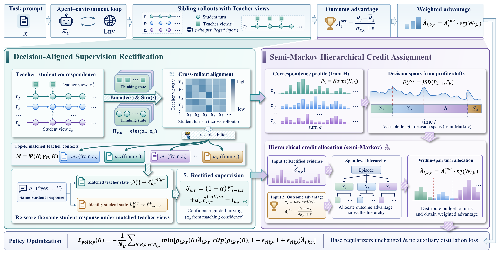
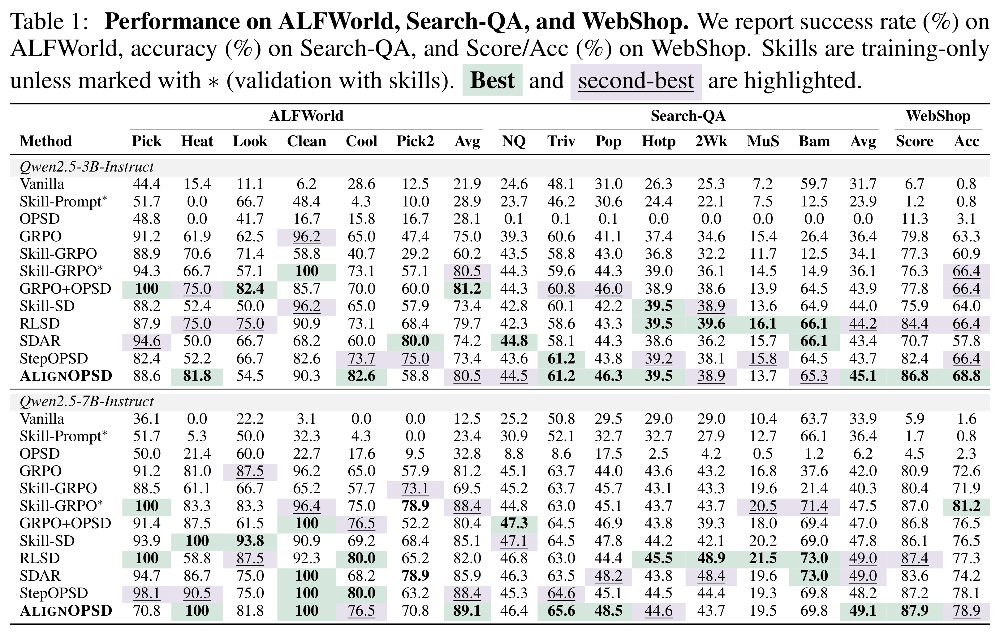

# Beyond Timestamps: Decision-Aligned On-Policy Distillation for Long-Horizon Agents

[](LICENSE)
[](https://arxiv.org/abs/2609.33391)
[](https://huggingface.co/papers/2609.33391)

## Overview

**AlignOPSD** uses teacher–student correspondence to rectify supervision and assign credit in agentic reinforcement learning. It aligns student turns with relevant teacher contexts across sibling rollouts, then uses the rectified evidence to distribute outcome credit across decision spans and individual turns for policy optimization.

- **Decision-Aligned Supervision Rectification:** match teacher contexts by thinking-state similarity and re-score the same student response with confidence-guided mixing.
- **Semi-Markov Hierarchical Credit Assignment:** identify variable-length decision spans from correspondence shifts and allocate outcome credit across spans and turns.

The repository supports **ALFWorld, WebShop and Search** with **Qwen2.5-3B/7B-Instruct**.

<p align="center">
  <a href="assets/alignopsd-method.png">
    
  </a>
</p>

<p align="center"><a href="assets/alignopsd-method.svg">Vector figure (SVG)</a></p>

## Installation

Requires Linux and NVIDIA GPUs.

```bash
git clone https://github.com/mingju-c/Align-OPSD.git
cd Align-OPSD
conda create -n alignopsd python=3.12.14 pip ninja packaging -y
conda activate alignopsd
python -m pip install -r requirements.txt
python -m pip install flash-attn==2.7.4.post1 --no-build-isolation
```

This environment is for **ALFWorld/Search**. **WebShop** requires a separate Python 3.10 environment; see the [installation guide](docs/training.md#installation).

## Quick Start

### Prepare models and data

Download the encoder at the required revision and a policy model:

```bash
hf download Qwen/Qwen3-Embedding-0.6B \
  --revision c54f2e6e80b2d7b7de06f51cec4959f6b3e03418 \
  --local-dir ./models/Qwen3-Embedding-0.6B
hf download Qwen/Qwen2.5-3B-Instruct --local-dir ./models/Qwen2.5-3B-Instruct
export MODEL_PATH=./models/Qwen2.5-3B-Instruct
```

Prepare the benchmark assets using the [data setup instructions](docs/training.md#assets). Search also requires a running retrieval service. Optional paths and settings are listed in [`.env.example`](.env.example); `.env` is not loaded automatically.

### Train

Choose the model size and run the launcher for your prepared benchmark.

**Qwen2.5-3B-Instruct**:

```bash
export MODEL_PATH=./models/Qwen2.5-3B-Instruct
# ALFWorld
bash examples/beyond_timestamps_trainer/run_alfworld_3b.sh
# WebShop (use its separate environment)
bash examples/beyond_timestamps_trainer/run_webshop_3b.sh
# Search
bash examples/beyond_timestamps_trainer/run_search_3b.sh
```

**Qwen2.5-7B-Instruct**:

```bash
hf download Qwen/Qwen2.5-7B-Instruct --local-dir ./models/Qwen2.5-7B-Instruct
export MODEL_PATH=./models/Qwen2.5-7B-Instruct
# ALFWorld
bash examples/beyond_timestamps_trainer/run_alfworld_7b.sh
# WebShop (use its separate environment)
bash examples/beyond_timestamps_trainer/run_webshop_7b.sh
# Search
bash examples/beyond_timestamps_trainer/run_search_7b.sh
```

Adjust GPU counts and batch sizes for your hardware: Search 3B defaults to four GPUs, several profiles use eight, and WebShop 3B targets 80 GB GPUs. See [configuration defaults](examples/beyond_timestamps_trainer/CONFIGS.md) and the [training guide](docs/training.md#training) for overrides, checkpoint resumption and a short training check.

### Validate configuration

```bash
python scripts/check_training.py --task search --model-size 3b --config-only
```

Supported tasks: `alfworld`, `webshop`, `search`; model sizes: `3b`, `7b`. See [validation](docs/training.md#validation) for environment checks and regression tests.

## Results

Main results on **ALFWorld, Search-QA and WebShop** with Qwen2.5-3B/7B-Instruct. Metrics are ALFWorld success rate, Search-QA accuracy, and WebShop Score/Acc (%). Click the table to view the full-resolution image.

<p align="center">
  <a href="assets/alignopsd-main-results.png">
    
  </a>
</p>

## Repository Structure

```text
Align-OPSD/
├── examples/       # Training launchers, data preparation and retrieval
├── verl/           # Method implementation and distributed training
├── agent_system/   # Benchmark integrations
├── skills/         # Skill mappings and texts
├── gigpo/          # Shared advantage helper
├── scripts/        # Preflight, release checks and checkpoint utilities
├── tests/          # Method and launcher regression tests
├── assets/         # Method figure and main results
└── docs/           # Detailed training guide
```

Internal `BeyondTimestamps` names are retained for configuration/checkpoint compatibility. Model weights, benchmark data and training outputs are not bundled.

## Acknowledgments

This work builds upon and adapts code from:

- [**SDAR**](https://github.com/ZJU-REAL/SDAR) — self-distilled agentic reinforcement learning framework
- [**veRL**](https://github.com/volcengine/verl) — distributed reinforcement learning framework for large language models

We sincerely thank the contributors of these projects for their work in advancing agentic reinforcement learning.

## License

This project is licensed under [Apache 2.0](LICENSE); original copyright headers and bundled licenses are retained. See [Notice.txt](Notice.txt).
